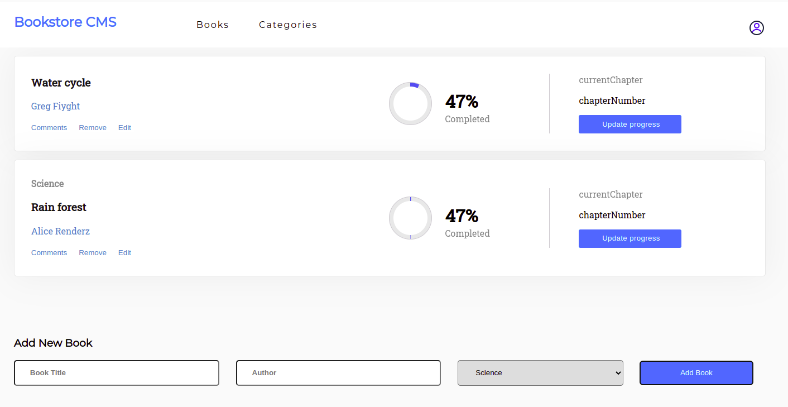

# Bookstore initialization
This is booklist app that i am building with React and Redux


# Bookstore initialization
On this last step of the project, I used style from `Zeplin`.

> Open with with the server

.

## Built With

- React
- Visual Studio Code.
- Linters
- Gitflow

## Live Demo

[github page](https://github.com/moise-mulungu/bookstore-app)

## Deploy 

- [Netlify](https://animated-stroopwafel-ca252e.netlify.app/)

## Getting Started

To get a local copy of this app you can use :
```
git clone  https://github.com/moise-mulungu/git clone  https://github.com/moise-mulungu/bookstore-app
```
# Install

- Run :
1. `npm create-react-redux.`
2. `cd <app's name>`,
3. `npm start`

# Usage

Run `npm start` to open the live server

## Author

👤 **Moise Mulungu**

- GitHub: [Moise Mulungu](https://github.com/moise-mulungu)
- Twitter: [Moise Mulungu](https://twitter.com/moise_mulungu)
- LinkedIn: [Moise Mulungu](https://www.linkedin.com/in/mo%C3%AFse-mulungu-a939831b2/)

## 🤝 Contributing

Contributions, issues, and feature requests are welcome!

Feel free to check the [issues page](https://github.com/moise-mulungu/bookstore-app/issues).


## Show your support

Give a ⭐️ if you like this project!

## 📝 License

This project is [MIT](./MIT.md) licensed.
 